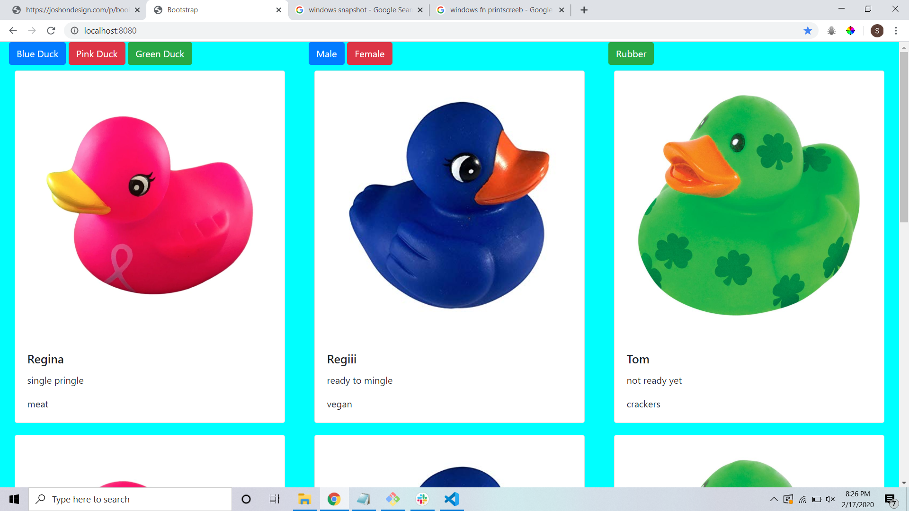

# BootStrap 101

## Description

This project is an exploration into the Bootstrap grid system.
We used Bootstrap cardsto display a collection of ducks (both real and rubber).
We also gave out users the ability to filter the ducks by color,
gender, and if the ducks are rubber.

## Screenshots

## How to Run

1. Clone down this repo
1. Make sure you have http-server installed via npm. If not get it
   [here](https://www.npmjs.com/package/http-server)
1. On your command line run `hs -p 8080`
1. In your browser go to `http://localhost:8080`
